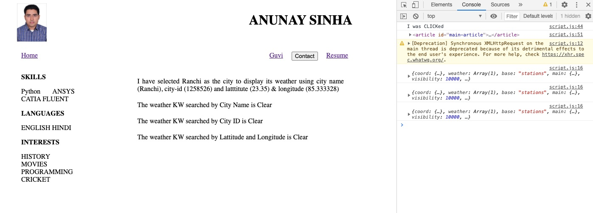

# GUVI-DAY-3
GUVI DAY 3

AS SEEN WE GET THE REQUIRED OUTPUT WHEN RUN LOCALLY. 

GITHUB flags the api given as insecure and thus does not allows it to run. Thus the error in deployment using git-hub
